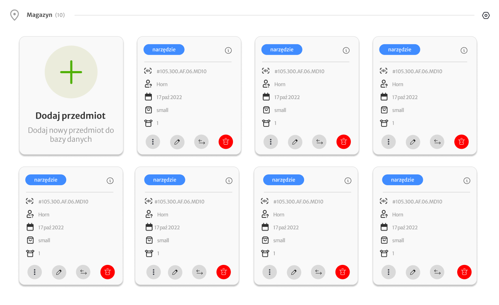
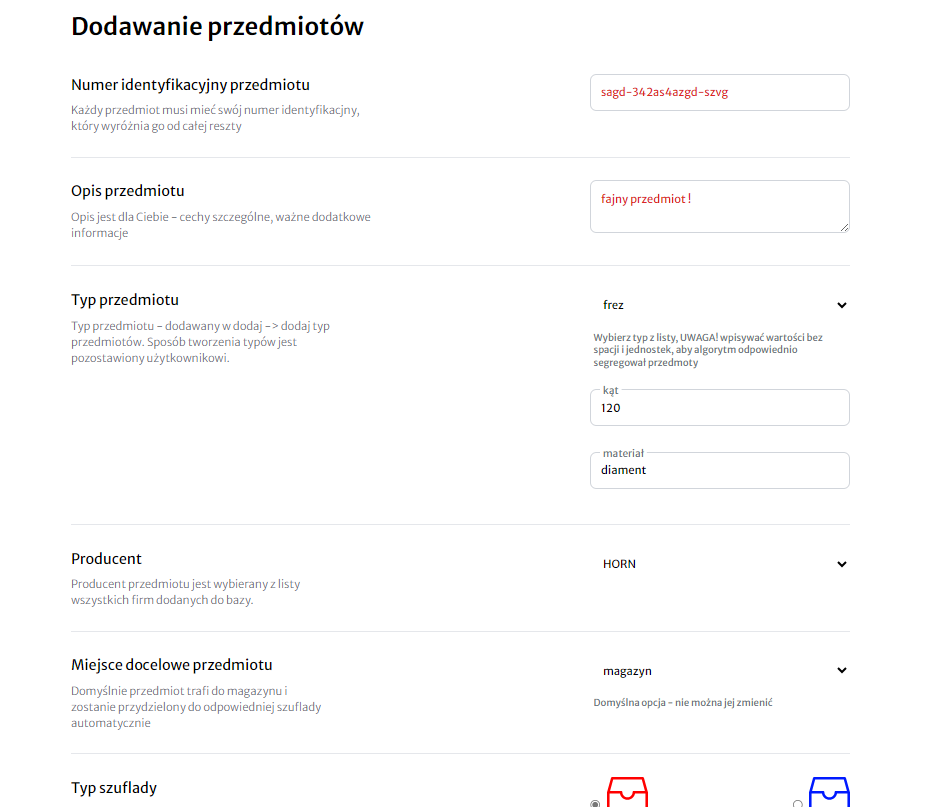
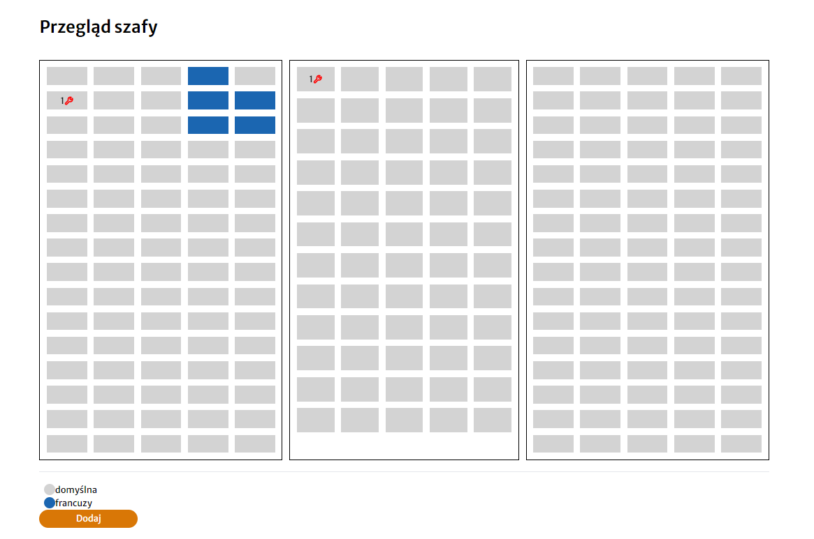
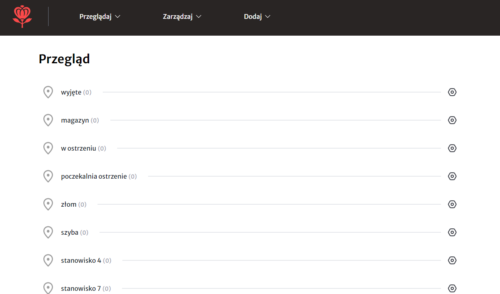

<div align="center">


🚧 **Under Construction** 🚧

This repository is still a work in progress.

   <h1>Item Magazine 🛠️</h1>
   
  <hr />
</div>

Welcome to the Item Magazine - a sophisticated, beautifully designed, and innovative digital magazine tool tailored specifically for our company's unique use case. This tool not only performs basic CRUD (Create, Read, Update, Delete) operations but also introduces special behaviors that stand out.

## Screenshots 📸

To give you a glimpse of our intuitive design and functionality, here are some screenshots from our application:

[//]: # (### **Example 4**)


[//]: # (### **Example 2**)


[//]: # (### **Example 4**)


[//]: # (### **Example 1**)


## Features 🌟

- **Item Types Creation**: Tailor the magazine to your specific needs by creating distinct types of items.

- **Organized Storage**: Items can be neatly placed into magazine cabinets, complete with individual shelves.

- **Categorized Shelves**: Shelves can be further divided into specific categories for a more refined organization.

- **Automatic Item Sorting**: Let the program do the heavy lifting! With our automatic item sorting system, you can keep your tools organized without any hassle.

- **Company & Packaging**: You can easily add company details and set up packages to be sent.

- **Highly Configurable**: The app has been designed with flexibility in mind, ensuring it fits perfectly with any changes or requirements.

## Technology Stack 🚀

Harnessing the power of modern technology to provide you with a seamless experience:
- **Frontend**: Crafted with [Next.js](https://nextjs.org/) (a React framework) combined with TypeScript for type-safe, efficient, and scalable code.

- **Database Management**: Uses [Prisma](https://www.prisma.io/) to ensure a robust and optimized database layer.

- **Form Verification**: Integrates [Zod](https://github.com/colinhacks/zod) with [React Form Hook](https://react-hook-form.com/) to ensure data integrity and user-friendly form interactions.

## Design ✨

Every pixel, every interaction, every animation is meticulously crafted. I've personally designed everything, ensuring not just functionality but also an appealing and intuitive user experience.

## Getting Started 🚀

1. **Clone the repository**:
   ```bash
   git clone https://github.com/MaciejKrawczyk/stelmach-magazine.git
   ```

2. **Navigate into the directory and install dependencies**:
   ```bash
   cd stelmach-magazine
   npm install
   ```

3. **Run the application**:
   ```bash
   npm run dev
   ```

Warning!
Now anytime you need to run a prisma command, you can use the scripts you just added to your package.json file.
- prisma migrate dev > npm migrate:dev
- prisma db push > npm db:push
- prisma migrate reset > npm migrate:reset
- prisma db seed > npm db:seed
- prisma generate > npm prisma:generate
- prisma studio > npm prisma:studio

## Contribution & Support 🤝

This is an in-house tool for our company. However, any feedback, suggestions, or contributions are always welcome! Please reach out or create an issue/PR in our repository.

## License 📜

Licensed under the Apache License, Version 2.0 (the "License");
you may not use this file except in compliance with the License.
You may obtain a copy of the License at

http://www.apache.org/licenses/LICENSE-2.0

Unless required by applicable law or agreed to in writing, software
distributed under the License is distributed on an "AS IS" BASIS,
WITHOUT WARRANTIES OR CONDITIONS OF ANY KIND, either express or implied.
See the License for the specific language governing permissions and
limitations under the License.

## Credits 💼

Designed & Developed by Maciej Krawczyk

 --- 

### PIERWSZE URUCHOMIENIE / PO WYCZYSZCZENIU BAZY
- /api/category => stworzyć domyślną kategorie
```http request
http://localhost:3000/api/category POST
```
```json
{
    "name": "domyślna",
    "color": "lightgray",
    "notes": "domyślna"
}
```
- /api/generateShelves => tworzy szuladki
```http request
http://localhost:3000/api/generateShelves POST
```